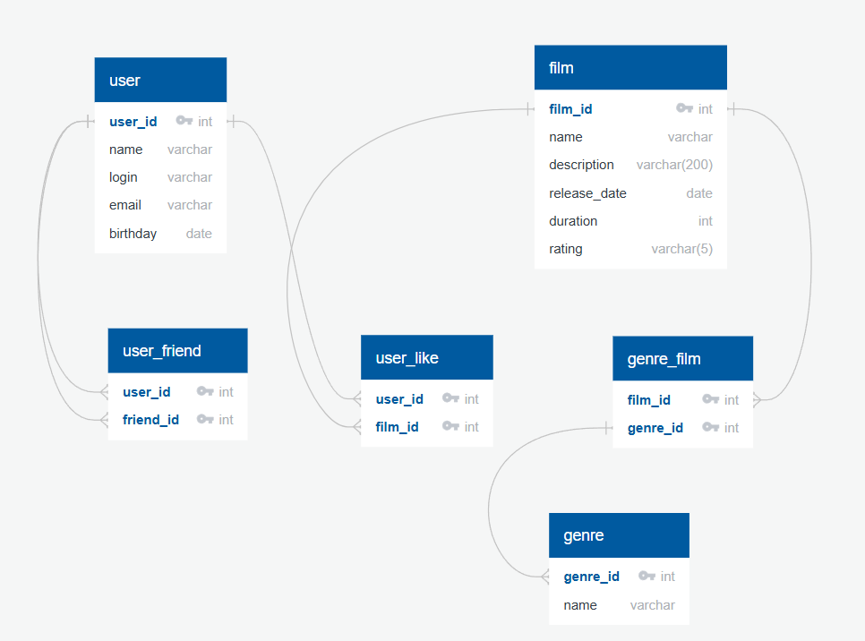

# java-filmorate
Template repository for Filmorate project.

В данной диаграмме представлена структура хранения данных приложения <Filmorate>.
В таблице <user> хранится основная информация о пользователях.
Таблица <user_friends> является связующей между пользователем и его друзьями.

Пример запроса на отображение всех друзей конкретного пользователя:

SELECT uf.friend_id, u.name
FROM user_friends AS uf
JOIN user AS u ON uf.friend_id=u.user_id
WHERE uf.user_id=1;

Таблица <film> хранит основную информацию и фильме.
Фильм может относится к разным жанрам, а у каждого жанра может быть множество фильмов, которые относятся к конкретному
жанру. Поэтому связь между фильмом и жанром - многое к многим. Между фильмом и жанрами есть связующая таблица
<genres_films>.

Пример запроса на получение жанров конкретного фильма:

SELECT g.name AS genre_name
FROM genres AS g
JOIN genres_films AS gf ON g.genre_id=gf.genre_film_id
JOIN film AS f ON gf.film_id=f.film_id
WHERE f.film_id=1;